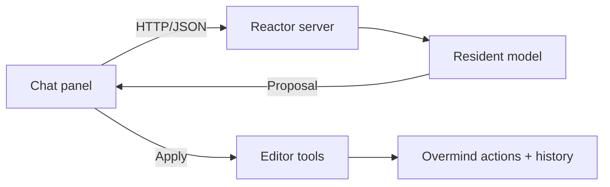

# ADR: Pluggable chat

Accepted design · 6 October 2026 · Not implemented; model selection pending benchmarks.

A lazy dockable panel sends a message and selection context to an in-process server model.
The model returns an answer, clarification, or one proposed edit. The browser validates and
applies edits through existing Overmind actions.

V1 is an editing assistant: one shape creation, property edit, or existing selection command
per proposal. Reactor owns geometry, validation, and history. Defer complete diagram
generation and multi-operation plans; a future batch needs one atomic Apply/Undo boundary.



## Boundaries

| Component       | Responsibility                                                  |
| --------------- | --------------------------------------------------------------- |
| Panel           | Messages, composer, Apply/Dismiss, Stop, New chat               |
| Browser service | Context capture, requests, cancellation, proposal lifecycle     |
| Tool registry   | Shared schemas and browser adapters over guarded editor actions |
| Server          | Authentication, validation, queue, model lifecycle              |
| Model provider  | Prompting, tokenization, constrained output, inference          |

Keep chat state per document/tab in the lazily loaded chat service, outside the store and
saved/shared content; the store holds only the panel's open flag. The service owns async work
and controllers; components read it through hooks. Lazy-load the panel, service, transport,
and tool adapters.

## UI and execution

- Reuse `DockablePanel`, controls, tokens, and focus styling. Hidden by default.
- Enter sends; Shift+Enter inserts a newline. Text inputs retain native shortcuts.
- Display document/selection context and plain-text replies. Preserve scroll position;
  announce completed replies accessibly and return focus to the opener on close.
- Keep one unresolved proposal per document. A new message dismisses it.
- Close, document/account change, and New chat abort requests and invalidate proposals.
  Request IDs reject late responses. Stop cancels inference, not an applied edit.
- Describe proposals from validated arguments; report success from actual execution results.
  Duplicate Apply returns the recorded result. Never automatically retry a mutation.
- Each accepted edit uses one [undo boundary](undo-redo.md). Redo never calls the model.

Apply/Dismiss remains the initial execution policy. Inference never writes document state.
Menus, chat, and future protocol adapters share guarded editor operations and the same
atomic history boundary; adapters add argument validation, not separate mutation paths.

## Tools

| Tool                    | Scope                                                  | Existing integration                               |
| ----------------------- | ------------------------------------------------------ | -------------------------------------------------- |
| `create_shape`          | One rectangle, ellipse, or text shape                  | `ShapeInput`, `addShape`/`drawShape`               |
| `set_property`          | One property on captured, individually selected shapes | `SHAPE_PROPERTIES`, `canEdit`, `setShapesProperty` |
| `run_selection_command` | Allowlisted align, space, group, ungroup, clone        | Command registry, `runCommand`                     |

Advertise applicable tools only. Group operations use existing group-aware commands.
Selection tools bind to targets captured at Send; the model supplies values, not arbitrary
IDs. Creation uses bounded geometry and the captured viewport center as its default position.
Existing actions assign IDs, names, order, and membership. Geometry uses `getShapeBounds`
and existing alignment functions.

Apply performs these checks in one synchronous action:

1. Proposal is current and unconsumed; document/account match; editor is writable and idle.
2. Captured selection and relevant geometry, membership, visibility, and locks still match.
   Compare semantic snapshots; unrelated document changes do not invalidate the proposal.
3. All arguments and targets are valid. Reject the whole operation if any target fails.
4. Commit through the shared edit boundary, then consume the proposal and record its
   outcome and affected IDs. Validation or preparation failure publishes nothing and creates
   no history.

Document access is device-local state populated from workspace roles, separate from content
locks. Unknown access blocks server-document edits. Refresh on document open, focus, sync
reconnect, and authorization failure; account changes clear it. Access loss cancels previews
and invalidates proposals. Recheck server access before Apply, then run the synchronous
checks above. Menus and history use the same access guard. The server must enforce revocation
on active sync connections as well as HTTP requests; cached client access is only a UI guard.
Local documents without accounts retain local editing permissions.

Return `proposed`, `applied`, `unchanged`, `stale_context`, `not_allowed`, or
`invalid_arguments`; `applied` and `unchanged` come only from the edit boundary's outcome.
Stale proposals require a fresh request. Exclude clipboard, account, document deletion/reset,
file dialogs, generated code, and arbitrary store mutation from the initial tool set.

## Model contract

```ts
type ModelDecision =
    | { kind: 'answer'; text: string }
    | { kind: 'clarify'; text: string }
    | { kind: 'proposal'; tool: string; input: Record<string, unknown> };

interface ChatModel {
    generate(request: ModelRequest, signal: AbortSignal): Promise<ModelDecision>;
    dispose(): Promise<void>;
}
```

`ModelRequest` contains bounded history, captured context, and server-owned tool definitions.
Validate complete outputs independently of constrained generation.

Start with `node-llama-cpp` and a resident GGUF model, using constrained JSON output.
Benchmark Qwen3.5 0.8B and 2B on Reactor operations; verify runtime, quantization, template,
and non-thinking configuration for each candidate. Select the smallest model that passes
accuracy, latency, and memory checks. FunctionGemma 270M is a later option if task-specific
fine-tuning is justified. No model is selected yet.

Exclude a separate decision model from v1; it adds a second inference path without
generating shape parameters, the core task. Prefer compact operation parameters and
deterministic editor geometry.

Pin the selected runtime/model/profile combination. A compatible model changes through
path/profile configuration and restart; another engine implements `ChatModel`. Neither
changes the panel or executor. The same boundary can support a separate inference service
later if measured memory or process stability makes in-process hosting unsuitable.

## HTTP and runtime

- `GET /api/chat/status`: `disabled | loading | ready | unavailable`, plus model label.
- `POST /api/chat/turn`: version, request ID, document ID, message, history, context, tool IDs.
  Response echoes version/request ID and returns `ModelDecision`.
- Use existing session, Origin, and document-role checks. Local-only documents in account
  mode are outside v1. Without accounts, allow only explicitly enabled loopback development
  with Host/Origin checks.
- Preserve the 16 KiB request limit. Trim oldest whole history turns first; mark truncation.
  If the selection cannot fit, request a narrower selection. Check token limits separately.
- Send relevant selected-item properties, group structure, and viewport context; exclude
  image bytes, full Yjs state, and unrelated content. Include previous execution outcomes.
- Treat document text/history as data. The server owns instructions, schemas, and settings.
- Initial limits: 4K context tokens, 256 output tokens, 15-second deadline including queue,
  one active generation, four queued, one outstanding request per account/local session.
- Load asynchronously at startup; keep editing available on load failure. Reset model
  conversation/KV state between users. Abort canceled, disconnected, or expired requests.
- Use async native inference with capped CPU threads. Measure event-loop and sync latency.
  Same-process native crashes or out-of-memory can still affect the server.
- Configure `CHAT_MODEL_PATH` (unset disables chat), `CHAT_MODEL_PROFILE`, `CHAT_THREADS`.
  Mount a checksum-pinned model read-only; never download during a request.
- Verify native packaging: the current Alpine container uses `--ignore-scripts`. A Debian
  slim chat build may be simpler. Copy shared contracts into the runtime image.
- Shutdown stops admission, aborts work, and disposes model resources within the existing
  deadline. Log model/profile, tool, timing, and outcome; exclude document contents.

Use buffered JSON initially. Add streaming only if measured latency warrants it. No agent
loop, separate model daemon, retrieval system, persisted chat history, or plugin loader.

## Protocols

| Boundary             | Choice                                                      |
| -------------------- | ----------------------------------------------------------- |
| Tool definitions     | Stable IDs, JSON Schema inputs/results, behavioral metadata |
| Embedded chat        | Versioned same-origin HTTP/JSON                             |
| Browser agents       | Optional, feature-detected WebMCP adapter                   |
| External AI clients  | MCP when a concrete integration requires it                 |
| In-process inference | `ChatModel` interface                                       |

All adapters share the executor. Map protocol-specific schemas, annotations, errors, and
lifecycle explicitly; annotations are hints, not authorization. Use the schema subset
supported by the model runtime and validate permissions at execution.

A WebMCP adapter adds `get_editor_context` with document ID, selection, and an opaque context
token. Proposals bind to that token and use the same Apply UI. A status read reports
applied/dismissed/stale outcomes. Registering WebMCP tools does not expose an MCP server.

A future MCP server needs an explicit choice between persisted-document access and a live
browser connection, plus authorization and lifecycle design. It must not introduce an
uncoordinated server-side mutation path. No agent-to-agent protocol is needed.

## Files and delivery

| Proposed location                  | Contents                                                       |
| ---------------------------------- | -------------------------------------------------------------- |
| `shared/chat.ts`                   | Wire types, schemas, validation; no React/browser dependencies |
| `src/chat/`                        | Browser service and its state, tool adapters                   |
| `src/ui/components/Chat/`          | Lazy panel                                                     |
| `server/chat.ts`                   | Routes, queue, readiness                                       |
| `server/chat/model.ts`, `llama.ts` | Provider contract/factory and native adapter                   |

Wire into app hooks/effects, UI controls/panel layout, `Designer`, API authentication, both
server entry points, and Docker/TypeScript configuration.

1. **Prerequisites:** implement access state, atomic commits, commit-only previews, and
   [undo/redo](undo-redo.md). Verify revocation and failures publish no unauthorized/partial edit.
2. **Runtime benchmark:** verify container compatibility; measure load time, peak memory,
   event-loop delay, and warm p50/p95 on recorded target hardware. Evaluate at least 100 fixed
   requests covering tools, arguments, clarification, unsupported requests, and hostile input.
   Initial targets: ≥95% correct decisions, zero invalid operations accepted, warm p95 <2 seconds.
   Set a deployment memory budget before choosing the model; retain results per pinned profile.
3. **Executor:** test validation, groups, permissions, stale local/remote state, duplicate
   Apply, and real document/collaboration outcomes.
4. **Panel/API:** test cancellation, late responses, focus, account/document changes, queue
   limits, timeouts, and cross-user context isolation with fake and real providers.
5. **Release:** run repository checks/build budgets, profile dragging during inference,
   verify disabled/failure modes, and repeat evaluations for each replacement model.
   Add WebMCP/MCP only when a concrete integration requires it.

## References

[Runtime](https://node-llama-cpp.withcat.ai/) ·
[Constrained output](https://node-llama-cpp.withcat.ai/guide/grammar) ·
[Qwen3.5 0.8B](https://huggingface.co/Qwen/Qwen3.5-0.8B) ·
[Qwen3.5 2B](https://huggingface.co/Qwen/Qwen3.5-2B) ·
[FunctionGemma](https://ai.google.dev/gemma/docs/functiongemma/model_card) ·
[MCP tools](https://modelcontextprotocol.io/specification/2025-11-25/server/tools) ·
[WebMCP](https://github.com/webmachinelearning/webmcp) ·
[Protocol comparison](https://developer.chrome.com/docs/ai/webmcp/compare-mcp)
